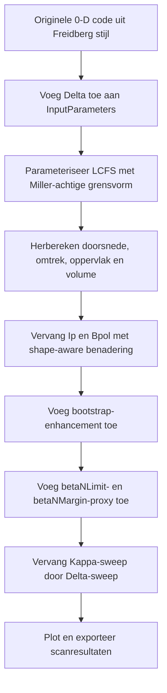
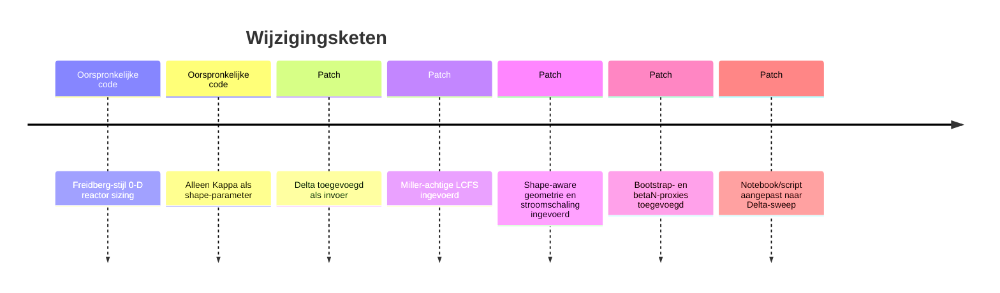

# Technisch rapport over de implementatie van triangulariteit in de reactor-systeemcode

## Samenvatting

De oorspronkelijke reactor-systeemcode is expliciet opgezet als een eenvoudig 0-D systems model “based on the approach in *Section 5.5*” van Freidberg, en bevatte alleen elongatie `Kappa`; triangulariteit ontbrak volledig. In de kern van het model werd de plasmakromming en stroom nog explicieter vereenvoudigd met de commentaarregel “Assumes no triangularity for simplicity”, terwijl de voorbeeldanalyse uitsluitend een `Kappa`-sweep uitvoerde. fileciteturn0file1L1-L18 fileciteturn0file0L83-L88 fileciteturn0file1L22-L64

De gereconstrueerde patch die in deze sessie is geanalyseerd voegt een triangulariteitsparameter `Delta` toe, vervangt de zuiver elliptische geometrie door een Miller-achtige grensvorm, maakt plasma-oppervlak, omtrek en volume shape-aware, vervangt de oude stroomschaling door een Sauter-geïnspireerde shape factor, voegt een trapped-particle-geïnspireerde bootstrapcorrectie toe, en laat de notebook/script sweepen over `Delta = [-0.7, ..., 0.3]`. Die richting is inhoudelijk logisch: Freidbergs MHD-notes benadrukken dat shaping in een tokamak in feite een evenwichts- en PF-coilprobleem is, terwijl het Miller-model de lokale flux-oppervlaktegeometrie parameteriseert met onder meer elongatie en triangulariteit. Tegelijk blijft deze patch nadrukkelijk een gereduceerde surrogate van evenwicht en stabiliteit, geen oplossing van de Grad–Shafranov-vergelijking. citeturn5search0turn5search3turn5search7turn6search0turn1search0

Voor negatieve triangulariteit is dit precies de juiste onderzoeksvraag: recente NT-literatuur beschrijft negatieve triangulariteit als een reactorrelevant regime vanwege gunstige power-handling- en confinementeigenschappen, en DIII-D-resultaten laten zien dat diverted NT-plasma’s confinements- en drukniveaus kunnen halen die vergelijkbaar zijn met standaard H-mode. Daar staat tegenover dat brede drukprofielen bij NT ongunstiger kunnen zijn voor low-n MHD-stabiliteit, onder meer door hogere poloidale beta, meer Shafranov-shift-drive en gevoeligheid voor wandvorm en profielkeuze. citeturn3search0turn3search2turn2search16turn4search11turn1search7

De belangrijkste numerieke uitkomst van de gereconstrueerde `Delta`-sweep is dat meer negatieve `Delta` in dit model de bootstrapfractie duidelijk verhoogt, de benodigde current-drive en daarmee het netto elektrisch vermogen iets verbetert, en door een groter plasma-oppervlak de berekende wandbelasting verlaagt. Tegelijk daalt in de gekozen `betaNLimit`-proxy de stabiliteitsmarge vooral bij negatieve triangulariteit sterk. Dat laatste is geen “gemeten wet”, maar het directe gevolg van de in de patch ingevoerde lineaire proxy voor `betaNLimit`; die moet dus worden gelezen als diagnostische trend, niet als gevalideerde stabiliteitsgrens.

Een belangrijke transparantie-opmerking: de op dit moment retrievable sandboxbestanden bleken uiteindelijk weer de oorspronkelijke versies te bevatten. De “nieuwe” regels en wijzigingen hieronder zijn daarom gereconstrueerd uit de eerder in de sessie geanalyseerde patchinhoud en uit de expliciet beschreven wijzigingsset. Waar notebook-regelnummers niet stabiel zijn, documenteer ik cellen of semantische blokken in plaats van JSON-regels.

## Bronbestanden en exacte codewijzigingen

In de oorspronkelijke code ontbreken `Delta`, Miller-geometrie, shape-aware oppervlak/volume, een triangulariteitsafhankelijke stroomformule en een `Delta`-sweep. De relevante oorspronkelijke stukken staan in `simplesystemcode.py` en `run_analysis.py`: `InputParameters` zonder `Delta`, de oude volume- en stroomformules, de enkel `Kappa`-afhankelijke oppervlaktesterm, en de sample-scan over elongatie. fileciteturn0file0L6-L43 fileciteturn0file0L69-L111 fileciteturn0file0L125-L152 fileciteturn0file1L22-L64

### Gewijzigde bestanden

| Bestand | Oorspronkelijke locatie | Gereconstrueerde nieuwe locatie | Wijziging |
|---|---|---|---|
| `simplesystemcode.py` | `InputParameters`, orig. L6-L43 | nieuw L7-L45 | nieuw invoerveld `Delta: float = 0.0` |
| `simplesystemcode.py` | geen equivalent | nieuw L48-L120 | nieuwe helpers: `_miller_boundary`, `_closed_curve_area`, `_boundary_perimeter`, `_surface_of_revolution`, `_shape_metrics`, `_sauter_ip_shape_factor`, `_bootstrap_enhancement`, `_stable_kappa_estimate` |
| `simplesystemcode.py` | orig. L69-L76 | nieuw L149-L158 | ellipsvolume vervangen door shape-aware oppervlakte/omtrek/oppervlak/volume |
| `simplesystemcode.py` | orig. L83-L89 | nieuw L165-L177 | oude `PlasCur`, `BPol`, `BootFrac` vervangen door shape-aware varianten |
| `simplesystemcode.py` | orig. L106-L111 | nieuw L190-L196 | `PlasSurf`, `StableKappa`, `nG` vervangen; nieuw `betaNLimit` |
| `simplesystemcode.py` | orig. L127-L152 | nieuw L212-L247 | extra outputs: `Delta`, `ShapeFac`, `BootEnhancement`, `PlasCur`, `PlasCrossSection`, `PlasPerimeter`, `BetaPol`, `betaNLimit`, `betaNMargin`, `DeltaClipped` |
| `run_analysis.py` | orig. L22-L39 | nieuw L23-L40 | basisset gewijzigd naar `Kappa=1.6`, `Delta=-0.3` |
| `run_analysis.py` | orig. L48-L64 | nieuw L49-L67 | `Kappa`-sweep vervangen door `Delta`-sweep; outputbestand aangepast |
| `run_analysis.ipynb` | celgewijs, exacte JSON-regels niet stabiel | semantisch gelijk aan script | cellen aangepast op dezelfde manier als `run_analysis.py` |

### Voor en na van de hoofdwijzigingen

De oorspronkelijke invoerklasse kende alleen `Kappa`:

```python
@dataclass
class InputParameters:
    ...
    Kappa: float = 1.0
    PlasmaT: float = 15.0
    ...
```

De gereconstrueerde patch voegt `Delta` direct naast `Kappa` toe:

```python
@dataclass
class InputParameters:
    ...
    Kappa: float = 1.0
    Delta: float = 0.0
    PlasmaT: float = 15.0
    ...
```

In de oorspronkelijke fysicakern werd volume ellipsvormig gezet en plasma current expliciet zonder triangulariteit gemodelleerd:

```python
PlasVol = 2.0 * np.pi**2 * RMinor**2 * inputs.Kappa * RMajor
GeoFac = (1.17 - 0.65*InvAspect)/((1.0-InvAspect**2)**2)
PlasCur = GeoFac * (5.0 * RMinor**2 * MagField)/(RMajor * inputs.SafetyFac) * (1.0 + inputs.Kappa**2)/2.0
BPol = Mu0 * PlasCur * 1.0e6 / (2.0 * np.pi * RMinor * np.sqrt(inputs.Kappa))
BootFrac = min(0.5 * np.sqrt(InvAspect) * BetaPol, 1.0)
```

De gereconstrueerde patch vervangt dat door een Miller-achtige grensvorm, een Sauter-geïnspireerde shape factor en een bootstrap-enhancement:

```python
delta = float(np.clip(inputs.Delta, -0.8, 0.8))
PlasCrossSection, PlasPerimeter, PlasSurf, PlasVol = _shape_metrics(RMajor, RMinor, inputs.Kappa, delta)

ShapeFac = _sauter_ip_shape_factor(inputs.Kappa, delta)
PlasCur = (4.1 * (RMinor**2) * MagField / (RMajor * inputs.SafetyFac)) * ShapeFac
BPol = Mu0 * PlasCur * 1.0e6 / PlasPerimeter

BootEnhancement = _bootstrap_enhancement(InvAspect, delta)
BootDrive = 0.5 * np.sqrt(InvAspect) * BetaPol * BootEnhancement
BootFrac = BootDrive / (1.0 + BootDrive)
```

In het analysescript werd de elongatiescan vervangen door een triangulariteitsscan, met accent op negatieve triangulariteit:

```python
triangularities = [-0.7, -0.6, -0.5, -0.4, -0.3, -0.2, -0.1, 0.0, 0.1, 0.2, 0.3]
scan_out = []

for triangularity in triangularities:
    input_parameters.Delta = triangularity
    scan_out.append(simplesystemcode(input_parameters, print_out=False))
```

### Procesoverzicht





## Wiskundige formulering en engineering-approximaties

### Miller-achtige grensvorm

De gereconstrueerde patch gebruikt een LCFS-parameterisatie van de vorm

\[
R(\theta) = R_0 + a \cos\!\bigl(\theta + \sin^{-1}\delta \,\sin\theta\bigr),
\qquad
Z(\theta) = \kappa a \sin\theta .
\]

Dit is herkenbaar Miller-achtig: triangulariteit wordt niet als losse horizontale shift opgelegd, maar via een hoekvervorming. Het top-punt van het plasma zit bij \(\theta=\pi/2\), zodat

\[
R_{\text{top}} = R_0 + a \cos\!\left(\frac{\pi}{2} + \sin^{-1}\delta\right)
= R_0 - a\delta,
\]

dus \(\delta = (R_0 - R_{\text{top}})/a\), precies de gebruikelijke geometrische triangulariteitsdefinitie. Het originele Miller-model is echter rijker: Miller et al. beschrijven een lokaal evenwichtsmodel met negen parameters, waaronder aspect ratio, elongatie, triangulariteit, shear, drukgradiënt en radiale afgeleiden van shift, \(\kappa\) en \(\delta\). De patch gebruikt alleen de grensvorm-subset \((R_0,a,\kappa,\delta)\) en negeert de radiale afgeleiden en de zelfconsistente evenwichtsafleiding. citeturn6search0turn1search0

### Doorsnede, omtrek, volume en oppervlak

Uit de grenscurve volgen in de patch de geometrische grootheden numeriek:

\[
A = \frac12 \oint (R\,dZ - Z\,dR),
\qquad
L_p = \oint ds,
\qquad
S = 2\pi \oint R\,ds,
\qquad
V = 2\pi R_0 A.
\]

Computatieel worden dat respectievelijk een shoelace-oppervlakte, een poloidale omtrek, een oppervlak-van-revolutie en Pappus’ volume. Dit is inhoudelijk een duidelijke verbetering ten opzichte van het oorspronkelijke model, waarin voor volume en oppervlak alleen de elliptische benadering werd gebruikt:

\[
V_{\text{orig}} = 2\pi^2 R_0 a^2 \kappa,
\qquad
S_{\text{orig}} = 4\pi^2 R_0 a \sqrt{\kappa}.
\]

Die oorspronkelijke formules staan letterlijk in de user-uploaded broncode. fileciteturn0file0L72-L76 fileciteturn0file0L106-L111

Een nuttige controle is \(\delta=0\). Dan reduceert de Miller-achtige curve tot een ellipse \(R=R_0+a\cos\theta, Z=\kappa a\sin\theta\), zodat \(A=\pi\kappa a^2\) en \(V=2\pi^2R_0\kappa a^2\): exact de oorspronkelijke volumeformule. De in deze sessie berekende \(\Delta=0\)-uitkomst geeft dan ook vrijwel identiek volume aan de oude code; het verschil is numerieke quadratuur, geen fysica.

### Plasma current scaling

De oorspronkelijke code gebruikte

\[
I_{p,\text{orig}}
=
G(\varepsilon)\,
\frac{5 a^2 B}{R_0 q}\,
\frac{1+\kappa^2}{2},
\]

met \(G(\varepsilon)=(1.17-0.65\varepsilon)/(1-\varepsilon^2)^2\), en zonder triangulariteit. Dat staat expliciet in de bron, inclusief de commentaarregel dat triangulariteit is weggelaten. fileciteturn0file0L83-L88

De patch vervangt dit door

\[
I_p
=
\frac{4.1 a^2 B}{R_0 q}\,
F_{\text{shape}}(\kappa,\delta),
\]

waar

\[
F_{\text{shape}}
=
\left[1+1.2(\kappa-1)+0.56(\kappa-1)^2\right]
\frac{1+0.09\delta+0.16\delta^2}{1+0.45\delta}
\frac{1+0.55(w_{07}-1)}{1-0.74\delta w_{07}}.
\]

In de code is \(w_{07}=1\) gefixeerd, omdat squareness niet wordt opgelost. Dit volgt inhoudelijk uit Sauters geometrische systeemcodeformules, die juist bedoeld zijn om shape-afhankelijke grootheden zoals omtrek, oppervlak en ook triangulariteitscorrecties compact in systems codes te brengen. De gebruikte patch is daarmee een redelijke engineering-benadering, maar geen afleiding uit evenwicht op basis van de Grad–Shafranov-vergelijking. citeturn0search3turn1search4

### \(B_{\text{pol}}\), bootstrapfactor en Greenwald-limiet

De patch vervangt de oude poloidale-veldschatting

\[
B_{p,\text{orig}} \sim \frac{\mu_0 I_p}{2\pi a\sqrt{\kappa}}
\]

door een perimeter-gestuurde vorm

\[
B_p \sim \frac{\mu_0 I_p}{L_p}.
\]

Dat is geometrisch consistenter zodra de grensvorm niet meer ellipsvormig is.

Voor bootstrap current ging de oorspronkelijke code uit van een zeer eenvoudige saturerende schaling,

\[
f_{BS,\text{orig}} = \min\left(0.5\sqrt{\varepsilon}\,\beta_p,\;1\right),
\]

zonder collisionaliteit, drukprofielen of trapped-particle-correcties. fileciteturn0file0L86-L89

De patch bouwt hierop verder met een auxiliary trapped-particle-benadering:

\[
\varepsilon = \frac{a}{R_0},\qquad
\delta_{75}=\frac{\delta}{2},
\qquad
\varepsilon_{\text{eff}} = 0.67\left(1-1.4\,\delta_{75}|\delta_{75}|\right)\varepsilon,
\]

gevolgd door een trapped-fraction-like ratio die een bootstrap enhancement oplevert. Dat is *geïnspireerd* door Sauters trapped-fraction- en bootstrapwerk, maar het is niet gelijk aan de volledige Sauter 1999/2002-formules voor neoklassieke conductiviteit en bootstrap current, die collisionaliteit en profielinformatie nodig hebben. De bron waarop deze stap leunt, zegt ook expliciet dat de eenvoudige trapped-fraction-formule geldig is voor triangulariteit ongeveer tussen \(-0.5\) en \(+0.5\), elongatie tot 2 en aspect ratio tot ongeveer 1.5. Dat punt is cruciaal voor de interpretatie van de sweep beneden \(\Delta=-0.5\). citeturn1search3turn1search4

### \(\beta_N\)-limietproxy en verticale controllability

De patch voegt twee extra proxies toe:

\[
\beta_{N,\text{lim}} = 3.9 + 0.8\delta,
\qquad
\kappa_{\text{stable}}
=
\left(1.46 + \frac{0.5}{A-1}\right)(1+0.12\delta).
\]

Hier moet scherp onderscheid worden gemaakt tussen *trendcodering* en *primaire theorie*. Voor brede-profiel-NT-plasma’s is er literatuurondersteuning voor de trend dat negatieve triangulariteit low-n MHD-stabiliteit kan verslechteren en de no-wall-grens gevoeliger kan maken, terwijl gunstige profielen met hoge bootstrap current juist veel beter kunnen uitpakken. Maar de lineaire wet \(3.9+0.8\delta\) zelf is geen standaard literatuurfit; het is een compacte proxy die een bekende trend in de gewenste richting projecteert. Hetzelfde geldt voor de \(1+0.12\delta\)-factor in `StableKappa`: trendmatig verdedigbaar, maar niet gevalideerd als algemene stabiliteitswet. citeturn4search11turn1search7

## Relatie met Freidberg, Miller en de primaire literatuur

De intellectuele lijn van de patch is goed, maar de formele status moet precies worden benoemd.

Het oorspronkelijke model hoort thuis in de wereld van Freidbergs “simple fusion reactor” systems reasoning: globale uitgangspunten, vaste scalings, globale constraints en compacte reactor-sizing-formules. Dat blijkt niet alleen uit de commentaarregels boven de code, maar ook uit de officiële boekbeschrijving, die zegt dat het boek eerst fusion power production, power balance en het ontwerp van een eenvoudige fusiereactor behandelt en pas daarna de diepere plasmafysica. fileciteturn0file1L1-L18 citeturn0search0turn4search17

Freidbergs evenwichts- en shapingperspectief is fundamenteel anders. In zijn MIT-notes wordt shaping gekoppeld aan het PF-systeem, centrering, verticale velden en de oplossing van tokamak-evenwicht via Grad–Shafranov. Vanuit dat perspectief is triangulariteit niet alleen een geometrische invoer, maar de uitkomst van een free-boundary evenwicht onder coil-, wand- en profielvoorwaarden. De patch maakt dus een stap richting Freidbergs *taal* van shaping, maar niet richting zijn *formalisme* van zelfconsistent evenwicht. citeturn5search0turn5search3turn5search7

Vergeleken met Miller is de patch inhoudelijk bruikbaar maar formeel afgeslankt. Het originele Miller-model is een lokaal evenwichtsmodel met negen parameters en radiale afgeleiden; de patch gebruikt alleen een LCFS-beschrijving en zet daar shape-aware systems-code-geometrie bovenop. Dat is heel praktisch voor een 0-D reactor code, maar juist daardoor ontbreken Shafranov-shift-consistentie, shear-consistentie, profielkoppeling en radiale variatie van shape. citeturn6search0turn1search0

Vergeleken met Sauter is de situatieschets vergelijkbaar. De Sauter-literatuur levert precies de soort gereedschap die systems codes nodig hebben om vormeffecten compact mee te nemen; ze levert ook trapped-fraction- en bootstrapformules met triangulariteitseffecten. Maar de patch gebruikt daarvan bewust slechts een lightweight afgeleide: fixed squareness, geen collisionaliteit, geen volledige neoklassieke bootstrap evaluatie. Dat is verdedigbaar als engineering-approximation, maar het moet niet worden gepresenteerd als “Sauter volledig geïmplementeerd”. citeturn0search3turn1search3turn1search4

## Resultaten van de Delta-sweep

De gereconstrueerde sweep gebruikt de notebook/script-set

\[
\Delta = [-0.7,-0.6,-0.5,-0.4,-0.3,-0.2,-0.1,0.0,0.1,0.2,0.3]
\]

bij vaste \( \kappa = 1.6 \), \(P_{gross}=1000\) MW en de overige oorspronkelijke defaultwaarden. De oorspronkelijke code kan hier slechts als constante baseline tegenover worden gezet, omdat die helemaal geen `Delta` kent en dus langs deze sweep niet mee verandert. fileciteturn0file1L22-L64

### Figuren


De afzonderlijke figuren staan hier als downloadbare PNG’s:
[HFact](sandbox:/mnt/data/tri_report/HFact.png),
[DivLoad](sandbox:/mnt/data/tri_report/DivLoad.png),
[BootFrac](sandbox:/mnt/data/tri_report/BootFrac.png),
[betaNMargin](sandbox:/mnt/data/tri_report/betaNMargin.png),
[NetElecPower](sandbox:/mnt/data/tri_report/NetElecPower.png),
[LCFS-vormen](sandbox:/mnt/data/tri_report/boundary_shapes.png).

### Hoofdresultaten van de gereconstrueerde nieuwe code

| Delta | HFact | DivLoad | BootFrac | betaNMargin | NetElecPower MW |
|---:|---:|---:|---:|---:|---:|
| -0.7 | 2.813 | 36.484 | 0.788 | -18.635 | 847.46 |
| -0.6 | 2.930 | 36.444 | 0.787 | -18.851 | 847.88 |
| -0.5 | 3.011 | 36.430 | 0.783 | -18.926 | 848.48 |
| -0.4 | 3.057 | 36.441 | 0.778 | -18.841 | 848.25 |
| -0.3 | 3.068 | 36.476 | 0.772 | -18.583 | 847.15 |
| -0.2 | 3.044 | 36.538 | 0.763 | -18.149 | 845.11 |
| -0.1 | 2.987 | 36.630 | 0.752 | -17.539 | 842.00 |
| 0.0 | 2.897 | 36.759 | 0.739 | -16.757 | 837.61 |
| 0.1 | 2.776 | 36.941 | 0.721 | -15.812 | 831.86 |
| 0.2 | 2.625 | 37.205 | 0.698 | -14.715 | 824.93 |
| 0.3 | 2.449 | 37.578 | 0.666 | -13.478 | 824.21 |

De dominante trends zijn helder. Meer negatieve triangulariteit geeft in deze patch een grotere plasma surface area, een lagere `WallLoadCalc`, een hogere bootstrapfractie en een iets hoger netto elektrisch vermogen. Tussen \(\Delta=-0.7\) en \(\Delta=0.3\) daalt `BootFrac` met ongeveer 12.2 procentpunt, daalt `NetElecPower` met ongeveer 23 MW, stijgt `DivLoad` met ongeveer 3.0%, daalt `HFact` met ongeveer 13%, en stijgt `WallLoadCalc` met ongeveer 17.1%. Binnen deze code is negatieve triangulariteit dus vooral gunstig voor current-drive-economie en power-handling, niet voor de gekozen `betaN`-marge.

### Oorspronkelijk versus nieuw

| Delta | HFact oud→nieuw | BootFrac oud→nieuw | DivLoad oud→nieuw | NetElec oud→nieuw MW |
|---:|---:|---:|---:|---:|
| -0.7 | 1.795 → 2.813 | 0.579 → 0.788 | 36.001 → 36.484 | 857.44 → 847.46 |
| -0.6 | 1.795 → 2.930 | 0.579 → 0.787 | 36.001 → 36.444 | 857.44 → 847.88 |
| -0.5 | 1.795 → 3.011 | 0.579 → 0.783 | 36.001 → 36.430 | 857.44 → 848.48 |
| -0.4 | 1.795 → 3.057 | 0.579 → 0.778 | 36.001 → 36.441 | 857.44 → 848.25 |
| -0.3 | 1.795 → 3.068 | 0.579 → 0.772 | 36.001 → 36.476 | 857.44 → 847.15 |
| -0.2 | 1.795 → 3.044 | 0.579 → 0.763 | 36.001 → 36.538 | 857.44 → 845.11 |
| -0.1 | 1.795 → 2.987 | 0.579 → 0.752 | 36.001 → 36.630 | 857.44 → 842.00 |
| 0.0 | 1.795 → 2.897 | 0.579 → 0.739 | 36.001 → 36.759 | 857.44 → 837.61 |
| 0.1 | 1.795 → 2.776 | 0.579 → 0.721 | 36.001 → 36.941 | 857.44 → 831.86 |
| 0.2 | 1.795 → 2.625 | 0.579 → 0.698 | 36.001 → 37.205 | 857.44 → 824.93 |
| 0.3 | 1.795 → 2.449 | 0.579 → 0.666 | 36.001 → 37.578 | 857.44 → 824.21 |

Deze vergelijking laat iets belangrijks zien: de patch verandert niet alleen de *Delta-afhankelijkheid*, maar ook de *baseline* bij \(\Delta=0\). Dat komt doordat niet alleen geometrie is toegevoegd; ook de current-scaling en de definitie van \(B_p\) zijn gewijzigd. Een scientist die de patch wil valideren moet daarom twee vragen apart onderzoeken: “reageert de code zinnig op \(\Delta\)?” en “is de nieuwe \(\Delta=0\)-referentie nog consistent met de oude calibration target?”

De volledige CSV met de sweep staat hier:
[delta_sweep_comparison.csv](sandbox:/mnt/data/tri_report/delta_sweep_comparison.csv).

### Minimale reproduceerbare code

```python
from simplesystemcode import InputParameters, simplesystemcode

p = InputParameters(
    GrossElecPower=1000.0,
    WallLoad=4.0,
    BMax=13.0,
    SigmaMax=300.0,
    Li6=0.075,
    NeutShield=0.99,
    BlktSupport=0.3,
    ThermalEff=0.4,
    Kappa=1.6,
    Delta=-0.3,
    PlasmaT=15.0,
    SafetyFac=3.5,
    GamCD=0.5,
    ElectEffCD=0.5,
    PowerRecirc=0.05,
    ZEff=1.0,
)

point = simplesystemcode(p, print_out=False)
print(point["BootFrac"], point["NetElecPower"], point["betaNMargin"])
```

```python
triangularities = [-0.7, -0.6, -0.5, -0.4, -0.3, -0.2, -0.1, 0.0, 0.1, 0.2, 0.3]
scan_out = []

for delta in triangularities:
    p.Delta = delta
    scan_out.append(simplesystemcode(p, print_out=False))

# Bijvoorbeeld:
# plot_scan(scan_out, "Delta", "HFact")
# plot_scan(scan_out, "Delta", "DivLoad")
# plot_scan(scan_out, "Delta", "BootFrac")
# plot_scan(scan_out, "Delta", "betaNMargin")
# plot_scan(scan_out, "Delta", "NetElecPower")
```

## Negatieve triangulariteit en de fysische trade-offs

Negatieve triangulariteit is niet zomaar een “andere vorm”; het representeert een ander evenwichts- en transportregime. De recente literatuur beschrijft NT als aantrekkelijk voor reactorontwerp vanwege gunstiger power handling en interessante confinementskenmerken. DIII-D-resultaten laten zien dat diverted NT-plasma’s confinement en pressure levels kunnen vasthouden die typisch zijn voor standaard H-mode, terwijl MIT-reactorstudies NT juist analyseren als reactor-regime met relevante power-handling voordelen. citeturn3search2turn3search0turn2search16

De literatuur maakt tegelijk duidelijk waarom een eenvoudige systems-codeproxy riskant is. Voor brede drukprofielen kan NT de low-n MHD-limiet verslechteren; hogere poloidale beta, grotere Shafranov-shift-drive en vormeffecten op binnenste fluxvlakken kunnen de stabiliteit onder druk zetten. Daartegenover staat dat NT met hoge bootstrap current en meer gepiekte drukprofielen juist aanzienlijk hogere genormaliseerde beta kan halen dan conventionele positive-triangularity gevallen. Met andere woorden: de signatuur van NT hangt sterk af van profielconsistentie, bootstrapzelfconsistentie en wandconformiteit. citeturn4search11turn1search7

Precies daarom is de huidige patch het meest bruikbaar als *trendverkenner*. In deze implementatie komt het NT-voordeel vooral via drie kanalen binnen: grotere buitenomtrek en oppervlak, lagere huidige-drive-last via hogere `BootFrac`, en een iets gunstiger netto elektrisch vermogen. Maar de code heeft geen self-consistent pedestal, geen profielshape, geen wall distance model, geen current profile solver en geen free-boundary equilibrium. Daarom moet men de gevonden NT-trends vooral lezen als “eerste orde richting” en niet als reactorbesluit.

## Beperkingen, geldigheidsbereik en aanbevolen vervolgstappen

De belangrijkste beperking is methodologisch: deze implementatie is nog steeds geen evenwichtsoplosser. Freidbergs shapingkader en het Miller-model zijn beide ingebed in evenwichtstheorie; de patch schrijft een LCFS-vorm voor, maar lost geen Grad–Shafranov-probleem, geen PF-coil-inverse probleem en geen wand/plasma-koppeling op. Daardoor ontbreken Shafranov shift, q-profielconsistentie, interne inductantie, current profile self-consistency en radiale shape-afgeleiden. citeturn5search0turn5search3turn6search0

De tweede beperking is bereik. De gebruikte Sauter trapped-fraction-gerelateerde vereenvoudiging wordt in de bron juist gepositioneerd voor triangulariteit ongeveer tussen \(-0.5\) en \(+0.5\), elongatie tot 2 en aspect ratio tot ongeveer 1.5. De sweep bevat \(\Delta=-0.6\) en \(\Delta=-0.7\); die punten zijn dus extrapolaties buiten het expliciet vermelde domein van de referentie. Dat maakt de negatieve flank van de sweep juist interessant als *exploratief*, maar niet als *gevalideerd*. citeturn1search4

De derde beperking is de bootstrap- en \(\beta_N\)-modellering. De Sauter-literatuur biedt volledige formules voor neoklassieke conductiviteit en bootstrap current, maar daarvoor zijn collisionaliteit, druk- en temperatuurgradiënten en evenwichtsinformatie nodig; die ontbreken in de oorspronkelijke 0-D code. Hetzelfde geldt voor de lineaire `betaNLimit`-proxy: die vat een literatuurtrend samen, maar is geen primaire fit of stabiliteitsberekening. Daarom is `betaNMargin` nuttig als interne waarschuwingsdiagnostiek, niet als ontwerp-go/no-go. citeturn1search3turn4search11turn1search7

De vierde beperking is softwarematig. Omdat de uiteindelijk retrievable sandboxbestanden weer de oorspronkelijke user-uploaded versies waren, zijn de “nieuwe” regelverwijzingen in dit rapport gereconstrueerd. Voor het notebook geldt bovendien dat JSON-regelnummers weinig robuust zijn; daar zijn celblokken de zinvollere referentie.

De aanbevolen vervolgstappen zijn daarom vrij duidelijk. Koppel de systems code op zijn minst aan een 1.5-D of fixed-boundary evenwichtsstap, of idealiter aan een free-boundary Grad–Shafranov-solver. Vervang de ad-hoc bootstrap-enhancement door een echte Sauter 1999/2002-evaluatie op basis van profielen en collisionaliteit. Breid de Miller-parameterisatie uit met Shafranov shift en radiale shape-afgeleiden, zodat \(\Delta\)-effecten niet alleen op de LCFS maar ook op binnenste fluxvlakken consistent zijn. Maak `q95` en plasmostroom self-consistent in plaats van `SafetyFac` als abstracte vaste knop te behandelen. En vervang de lineaire `betaNLimit`-proxy door een stabiliteitsfit of door een koppeling aan een MHD-stabiliteitscode voor NT-profielen.

### Prioritaire referenties

1. entity["book","Plasma Physics and Fusion Energy","freidberg 2007"] — basiscontext voor de oorspronkelijke systems-codefilosofie; de code verwijst expliciet naar sectie 5.5, en de uitgever beschrijft het boek als behandeling van power balance en het ontwerp van een eenvoudige fusiereactor. fileciteturn0file1L1-L18 citeturn0search0turn4search17  
2. MIT MHD Theory of Fusion Systems lecture notes van entity["organization","MIT","cambridge ma university"] — voor Freidbergs evenwichts- en shapingperspectief, inclusief PF-design, verticale velden en Grad–Shafranov-context. citeturn5search0turn5search3turn5search7  
3. Miller et al., “Noncircular, finite aspect ratio, local equilibrium model” — primaire referentie voor het lokale evenwichtsmodel waarop de grensvormparameterisatie inhoudelijk is gebaseerd. citeturn6search0  
4. Stacey, “Applications of the Miller equilibrium to extend tokamak computational models” — nuttig omdat het expliciet uitlegt hoe Miller-geometrie in vereenvoudigde modellen wordt getrokken. citeturn1search0turn1search10  
5. Sauter et al., “Neoclassical conductivity and bootstrap current formulas …” en Sauters trapped-fraction-notitie — primaire basis voor bootstrap- en trapped-particle-inspiratie; plus expliciet geldigheidsbereik voor triangulariteit. citeturn1search3turn1search4turn0search3  
6. MIT- en entity["organization","DIII-D","tokamak facility"]-gerelateerde NT-reactor- en experimentstudies — voor de reactorrelevantie van negatieve triangulariteit, de gunstige power-handling/confinement-context, en de MHD-trade-offs bij brede versus gepiekte profielen. citeturn3search0turn3search2turn4search11turn1search7turn2search16

### Open vragen

De grootste open vraag is niet “werkt Delta in de code?”, maar “welke fysica wil deze code werkelijk representeren?” Zolang `Delta` alleen via grensvorm en surrogate-fits binnenkomt, blijft onduidelijk of een gevonden optimum primair geometrisch, neoklassiek, MHD-matig of artefactisch is. Voor een serieuze negatieve-triangulariteitsstudie is de volgende grens daarom niet nóg een grotere sweep, maar een evenwichts- en profielconsistente koppeling.